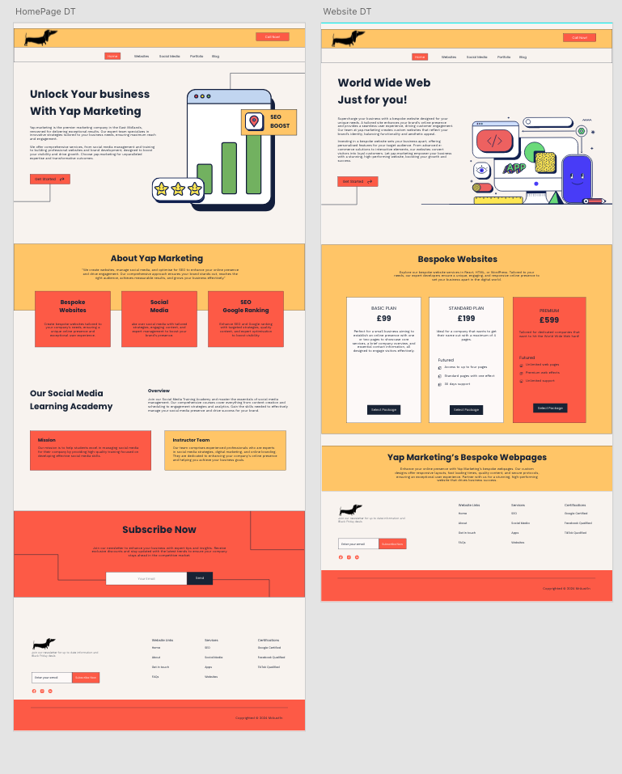
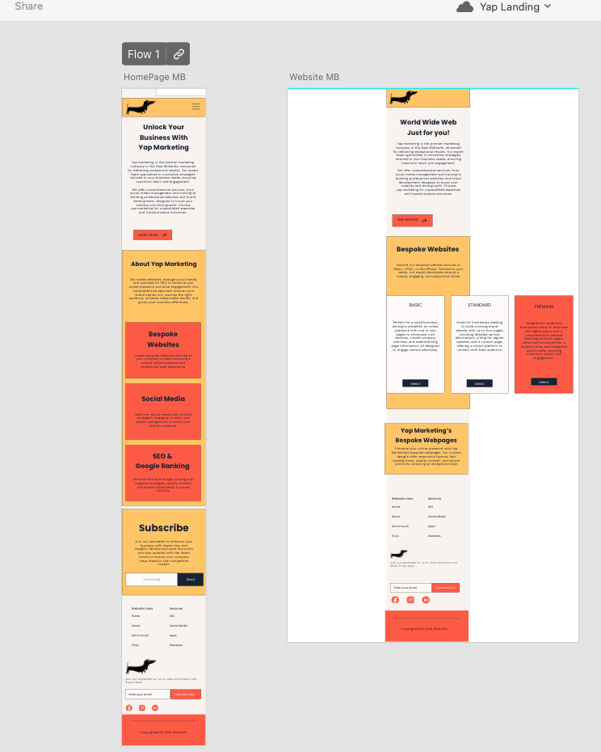
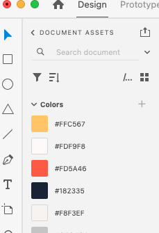
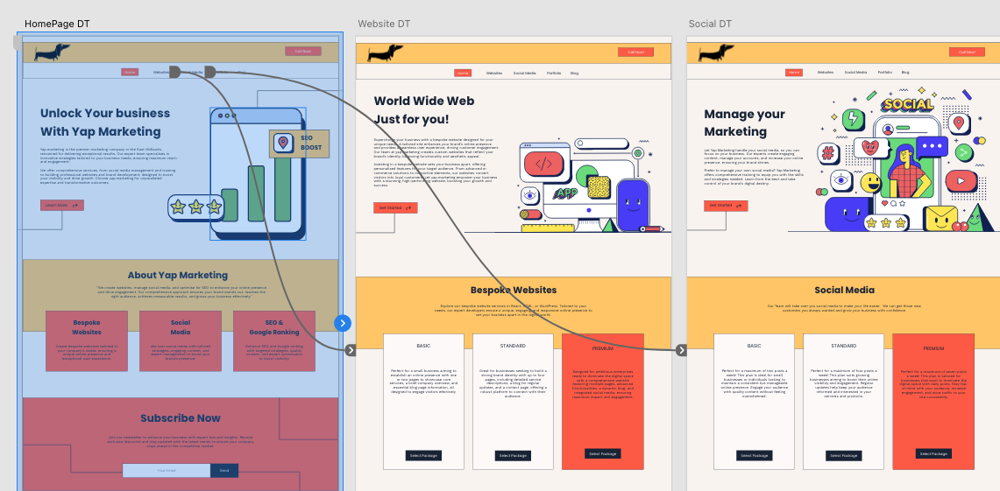

# [Yap Marketing](https://github.com/mr-aust1n/milestone-project-one "Repo")

# [Yap Marketing](https://mr-aust1n.github.io/milestone-project-one/?nocache=true "Live Site")

- Yap Marketing is a simple Website for marketing company
- Yap Marketing has been designed in adobe xd to help me create UI/UX before any code began
- Yap Marketing is built for people looking for someone to manage their social media or have a website built
- Yap Marketing has been built for mobile, iPad and desktop versions with media quires
- Yap Marketing displays a number of heros that are relevant to the page you are on.
- Yap Marketing is a website for small to medium businesses.

## Table of Contents

<details>
<summary>Click here for Table of Contents</summary>

[Mockup Screenshots](#mockup-screenshots)

[UX](#ux)

- [Colour Scheme](#colour-scheme)
- [Typography](#typography)

[User Stories](#user-stories)

- [New site Users](#new-site-users) also see [Testing](TESTING.md)
- [Returning Site Users](#returning-site-users)[Testing](TESTING.md)

[Wireframes](#wireframes)

- [Mobile Wireframes](#mobile-wireframes)
- [Desktop Wireframes](#desktop-wireframes)

[Features](#features)

- [Future Features](#future-features)

[Testing](TESTING.md)

[Deployment](#deployment)

- [Local Deployment](#local-deployment)

  - [Cloning](#cloning)
  - [Forking](#forking)

- [Local vs Deployment](#local-vs-deployment)

[Credits](#credits)

- [Media](#media)

</details>

## Mockup Screenshots

Below are two mockup images of the Yap Marketing website created using the adobe xd software.

|               Screenshot 1 Desktop               |                  Screenshot 2 Mobile                   |
| :----------------------------------------------: | :----------------------------------------------------: |
|  |  |

## UX

- The design for Yap Marketing was created as a series of wireframes covering mobile, tablet and desktop to determine the initial design and layout of the site.
- Yap Marketing site was designed with ease of use and simplicity in mind.
- A simple clean look was built so that all a user needs to do is enter their town or city name and click search.

### Colour Scheme

- The chosen colour scheme for Yap Marketing is designed to be inviting and have a neutral aesthetic while giving a nice splash of deep yellow and red to make it come alive.
- The colours used are as follows:-

- `#FFC567` used for one box colour.
- `#FD5A46` used for a second box colour.
- `#182335` used for text and borders.
- `#F8F3EF` used for a background colour.
- `#FDF9F8 and for a second bg color.

I used the website [https://coolors.co] to generate my colour palette

<details>
<summary>Click for Colors screenshot</summary>



</details><br>

I have used CSS `:root` variables to easily update the global colour scheme by changing only one value, instead of everywhere in the CSS file. I have also done the same for H tags and font sizes, weights and families.

```css
:root {
  /* Colors: */
  --color-yellow: #ffc567;
  --color-red: #fd5a46;
  --color-black-mid: #182335;
  --color-blue: #3a5a84;
  --color-bgcolor: #f8f3ef;
  --color-bgcolor-lighter: #fdf9f8;

  /* Sizes */
  --fs-h1: 54px;
  --fs-h2: 30px;
  --fs-h3: 22px;
  --fs-h4: 18px;
  --fs-p: 16px;
  --fs-a: 12px;
  /* Weight */
  --fw-bold: 600;
  --fw-h2: 600;
  --fw-h3: 600;
  --fw-h4: 100;
  /* Font Families */
  --ff-primary: "Poppins", sans-serif;
  --ff-secondary: "Work Sans", sans-serif;
}
```

### Typography

- I used the Google Font called 'Work Sans' and 'Poppins' for the Yap Marketing site.
- I felt that this font had a nice modern style that is easy to read and that it fitted well with the Yap Marketing site and its funky appeal.

- [Work Sans](https://fonts.google.com/specimen/Work+Sans?query=work+sans) was used for most of the text within the site.

- [Poppins](https://fonts.google.com/?query=poppins) was used as a secondary font.

## User Stories

See [Testing](TESTING.md)

### New Site Users

- As a new site user, I would like to know what the site is about, so that I understand what the site does.
- As a new site user, I would like to see what services you can offer.
- As a new site user, I would like to see what packages you offer.
- As a new site user, I would like to see if you can make my business better.
- As a new site user, I would like to navigate freely and not get lost.

### Returning Site Users

- As a returning site user, I would like to upgrade or get other services.

## Wireframes

To follow best practice, wireframes were developed for mobile, tablet, and desktop sizes using adobe XD.

### Mobile Wireframes

|                    Main pages                     |
| :-----------------------------------------------: |
|  |

### Desktop Wireframes

|                    Main pages                     |
| :-----------------------------------------------: |
|  |

## Features

I have included the following features:

Contact Form
Easy Call from the menu

**Footer Yap Marketing**  
The 'Footer' is a simple access for when you get to the bottom of the page.  
[screenshot](documentation/images/footer.png)

**Yap Marketing Menu**
Desktop Menu  
[screenshot](documentation/images/dtmenu.png)

Mobile Menu

[screenshot](documentation/images/mobileM.png)

## Deployment

## Local Deployment

For my local deployment I used 'Five Server' This allowed me to deploy on my network and and by putting in the ip address given I could look at the site as long as it was on the same wifi.
[screenshot](documentation/deploy/local_deploy.png)
