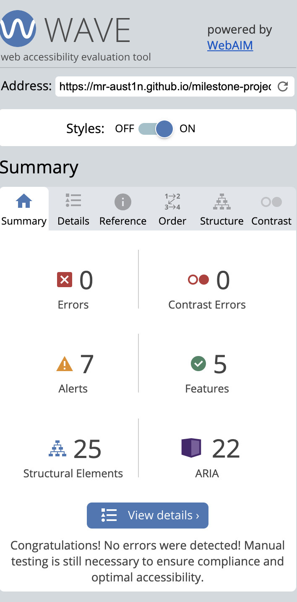
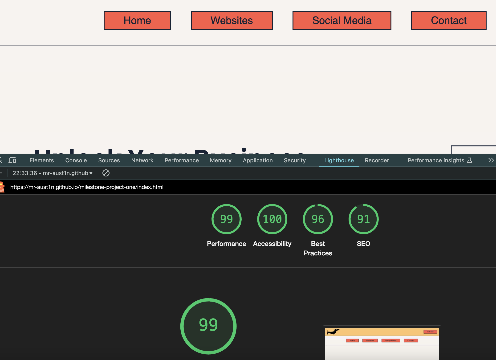

# Testing

Return back to the [README.md](README.md) file.

## Table of Contents

Click here for Table of Contents

- [Code Validation](#code-validation)

  - [HTML](#html)
  - [CSS](#css)
  - [JavaScript](#javascript)

- [Browser Compatibility](#browser-compatibility)

- [Responsiveness](#responsiveness)

- [Accessibility](#accessibility)

- [Lighthouse Audit](#lighthouse-audit)

- [User Story Testing](#user-story-testing)

- [Bugs](#bugs)

## Code Validation (HTML & CSS Validation is mentioned in the readme.md file)

### HTML

I have used the recommended [HTML W3C Validator](https://validator.w3.org) to validate all of my HTML files.

| Page | W3C URL | Screenshot | Notes |

| Home Page | [W3C](https://validator.w3.org/nu/?doc=https%3A%2F%2Fmr-aust1n.github.io%2Fmilestone-project-one%2Findex.html) |
 | Errors - role is unnecessary for element |

| Main Page | [W3C] |  | Fixed by removing unnecessary aria labels - Pass: No Errors or Warnings |

### CSS

I have used the recommended [CSS Jigsaw Validator](https://jigsaw.w3.org/css-validator) to validate all of my CSS files.

| style.css | [Jigsaw](https://jigsaw.w3.org/css-validator/validator?uri=https%3A%2F%2Fmr-aust1n.github.io%2Fmilestone-project-one%2Findex.html&profile=css3svg&usermedium=all&warning=1&vextwarning=&lang=en) |  | FAIL: var colours not selected properly |

| style.css | [Jigsaw](https://jigsaw.w3.org/css-validator/validator?uri=https%3A%2F%2Fmr-aust1n.github.io%2Fmilestone-project-one%2Findex.html&profile=css3svg&usermedium=all&warning=1&vextwarning=&lang=en) |  | Pass: No Errors |

### JavaScript

I have used the recommended [JShint Validator](https://jshint.com) to validate all of my JS files.

|  File   |                     Screenshot                     |      Notes      |
| :-----: | :------------------------------------------------: | :-------------: |
| main.js |  | Pass: No Errors |

## Browser Compatibility

I have tested my website on the below to check its functionality works as intended.

[Chrome] | [screenshot](documentation/browser/chrome.png)

[Safari] | [screenshot](documentation/browser/safari.png)

Results | Worked as expected |

## Responsiveness

I have tested my deployed project on multiple devices to check for responsiveness issues.

[Chrome]  
Desktop | [screenshot](documentation/browser/chrome.png)  
iPad (768px) | [screenshot](documentation/browser/chrome_ipad.png)  
iPhone | [screenshot](documentation/browser/chrome_iphone.png)

Results | Worked as expected |

[Safari]  
Desktop | [screenshot](documentation/browser/safari.png)  
iPad (768px) | [screenshot](documentation/browser/safari_ipad.png)  
iPhone | [screenshot](documentation/browser/safari_phone.png)

Results | Worked as expected |

## Accessibility

I have tested my deployed project using the [WAVE](https://wave.webaim.org/report#/https://mr-aust1n.github.io/milestone-project-one/index.html) web accessibility evaluation tool to check for any accessibility issues.

 |

A couple of minor contrast errors for the font color. I would go back to the planning stage and change these so that my designs would be better for the end users that have accessability needs.

## Lighthouse Audit

I have tested my deployed project using the Lighthouse Audit tool that is in chrome. This helped me to check for any issues.

 |  | Few warnings about best practices |

- I am able to ignore these as I can not get HTTPS on github pages.
- The second warning was that my google video was using 3rd party coockies and after checking the internet, there is not much I can do about this.

## User Story Testing

User | As a new site user, I would like to know what the site is about, so that I understand what the site offers. |

User | As a new site user, I would like to know see more of what is offered on your social channels |

User | As a new site user, I would like to see some kind of prices |

User | As a new site user, I would like be able to get in touch |
 

## Bugs

The following are bugs that I have come across while creating the website.

- The mobile menu would not display properly.

|              Original image               |                Bug fixed image                |
| :---------------------------------------: | :-------------------------------------------: |
|  |  |

- To fix this I added a with of auto as it was initially set to 800px
